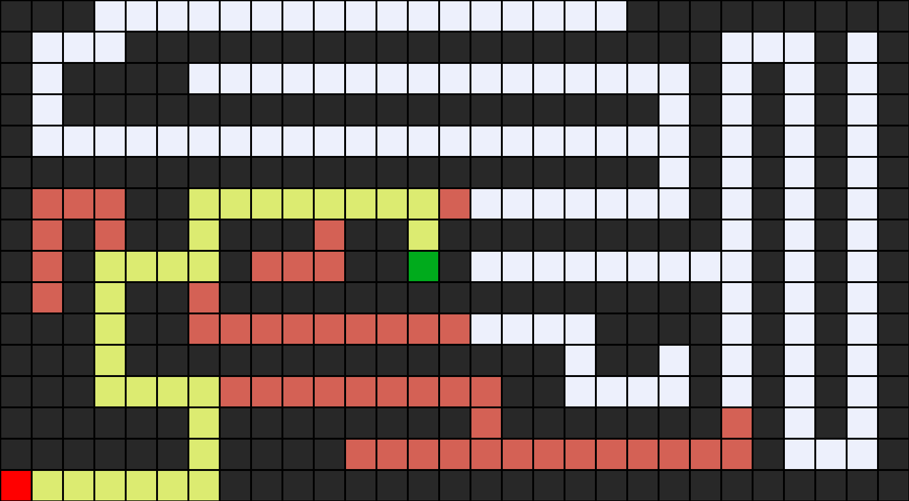
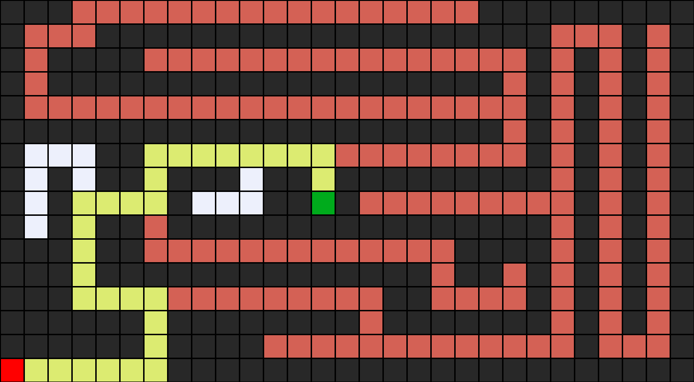

# Python AI Sandbox

> Collection of simple experiments, scripts, and toy AI/algorithm projects in Python. For learning and demonstration purposes.

---

## Directory Overview

- `shared.py` – general utilities used by subprojects
- `maze/` – maze-solving algorithms (`maze.py`, inputs/outputs, screenshots)

---

## Projects

### 1. Maze Solver

A minimal toy project for exploring different maze-solving and pathfinding strategies.

**Key files:**
- `maze/maze.py` – main solver script
- `maze/maze1.txt`, `maze/maze2.txt`, `maze/maze3.txt` – example mazes to solve
- `maze/QueueFrontier_maze1.png`, ... – solver result visualizations (BFS/DFS)
- `maze/README.md` – how-to for the maze component

**How to run:**
```sh
cd maze
python maze.py maze1.txt
```
*You can replace `maze1.txt` with any other test file in the `maze/` directory.*

**Sample output:**
The script will output the solution and optionally save an image if configured.

Example usage from [maze/README.md](maze/README.md):

```
Maze solving algorithm.

Usage: python maze.py maze1.txt
```

Example screenshots (see repo for more):




---

### 2. Shared utilities

**shared.py** contains general helper functions that can be imported and used across different subprojects in this repo.

---

## How to Use

- Clone this repository:
    ```sh
    git clone https://github.com/szymoniwacz/python-ai-sandbox.git
    cd python-ai-sandbox
    ```
- See the `/maze` directory for the maze solver demo.
- Add your own AI/sandbox projects as new directories or Python scripts!

---

## Project Status

:hammer_and_wrench: Experimental, educational and not actively maintained. Intended as a portfolio sandbox.

---

## License

MIT

---

## Context

This repository collects experiments in basic AI, search, and algorithmic thinking with Python.  
Feel free to use as boilerplate and submit your own little sandboxes!
